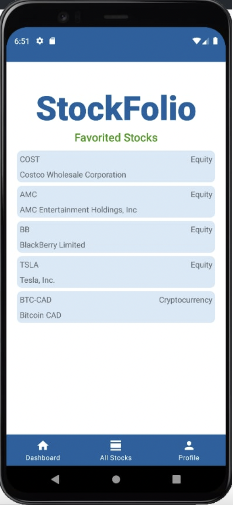

# Stockfolio 

## What is Stockfolio?
Stockfolio is an Android application for users to view & track any listed equities. From stocks to cryptocurrencies, users can add any of these equities to their favorites & view them from the Stockfolio dashboard!

## Setting up & running Stockfolio
Stockfolio is best run on the AB Virtual Device Pixel 5 API 28.
If necessary, the Firebase account credentials are as follows: 
- Username: gymworm.team@gmail.com
- Password: Orbital123!@#
